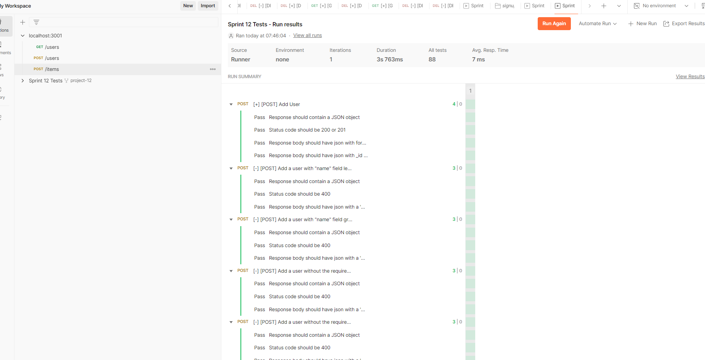
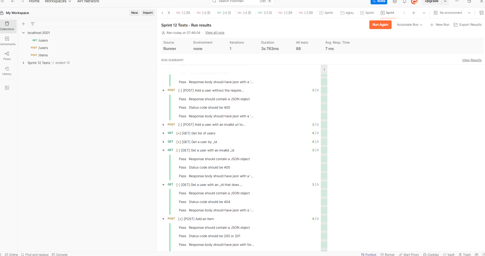

WTWR (What to Wear?): Back End
This is the back-end server for the WTWR (What to Wear?) application, designed to manage user authentication, handle a collection of clothing items, and enable user interactions like liking or disliking items. Built with Node.js, Express, and MongoDB, this project focuses on creating a secure, scalable, and maintainable API with comprehensive testing and CI/CD integration.

Features
User registration and login using JWT

Secure password hashing with bcrypt

CRUD operations for managing clothing items

Like and dislike functionality for user interactions

Centralized error handling for robust API responses

Input validation using Celebrate and Joi

Environment-based configuration for flexibility

Automated test runs via GitHub Actions for CI

Project Structure

.
├── controllers/
├── models/
├── routes/
├── utils/
├── app.js
├── .eslintrc
└── package.json

Running the Project Locally

1. Clone the Repository

git clone https://github.com/aliminagar/se_project_express.git
cd se_project_express

2. Install Dependencies

npm install

3. Start the Server

npm run start

4. Start in Development Mode (with Hot Reload)

npm run dev

5. Set the Sprint Version
   Edit the sprint.txt file in the project root and specify the sprint number you're working on (e.g., 12, 13).
   Testing
   Postman
   All API routes have been thoroughly tested using Postman. The test suite includes:
   Creating users with both valid and invalid inputs

Creating and deleting clothing items

Liking and disliking items

Validating ObjectId formats

Handling edge cases and ensuring proper error responses

Screenshot of successful Postman tests:
Postman Tests
GitHub Actions
Continuous integration is set up with GitHub Actions. Each push triggers automated tests defined in:
.github/workflows/tests-12.yml

.github/workflows/tests-13.yml

These workflows ensure:
Adherence to linting rules

Correct route logic

Proper file structure

Valid object destructuring and comment formatting

Screenshot of a passing GitHub Actions workflow:

### ✅ Postman Test Results

**Figure 1 and 2:** These screenshots show successful test responses in Postman, verifying proper API behavior and error handling.

---

### ⚙️ GitHub Actions Results

**Figure: 3** GitHub Actions workflow runs for Sprints 12 and 13. All final commits passed automated validation and linting checks.
GitHub Actions

Technologies Used
Node.js

Express.js

MongoDB with Mongoose

bcrypt for password hashing

JWT (jsonwebtoken) for authentication

Celebrate and Joi for input validation

GitHub Actions for CI/CD

Notes
Ensure MongoDB is running locally or provide a connection string for remote access.

Do not commit sensitive environment variables to version control.

Always update the sprint number in sprint.txt before committing changes.

Author
Alireza Minagar
GitHub: @aliminagar
